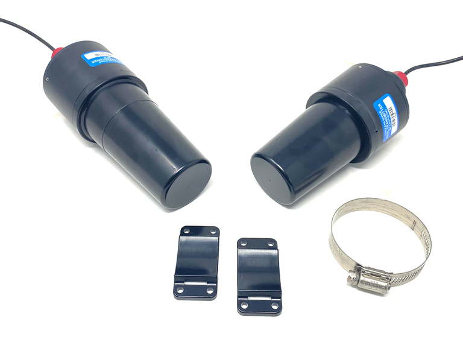
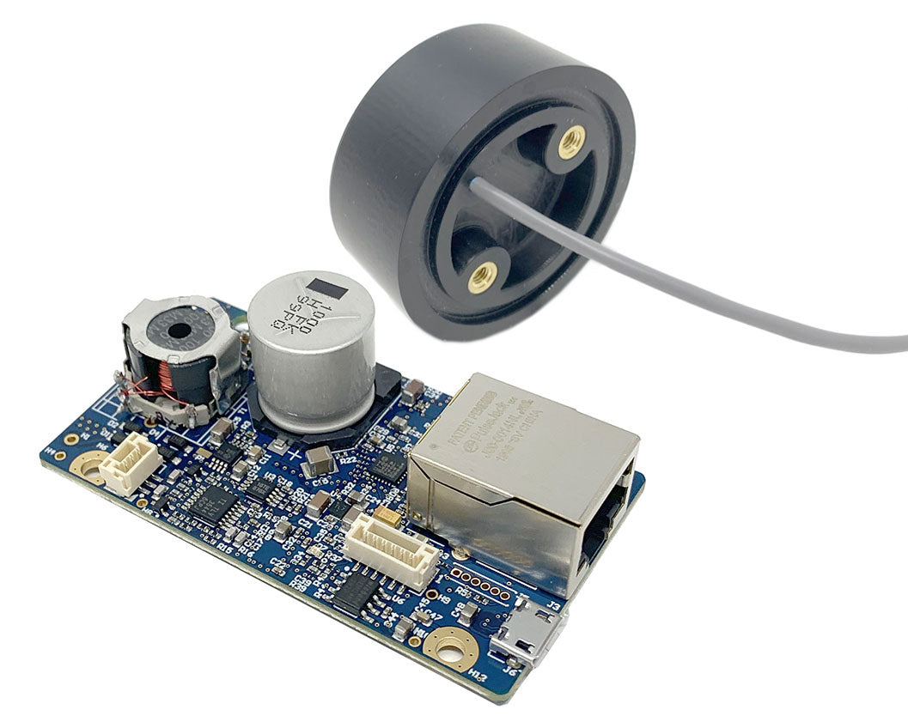

# Cerulean Sonar ROS

Set of Ethernet and Serial communication drivers for CeruleanSonar sensors for ROS.

## Tracker 650 DVL

Connect the DVL via ethernet, see the [official documentation](https://docs.ceruleansonar.com/c/tracker-650) for more info.

    roslaunch cerulean_sonar_ros tracker650.launch

### Published Topics:
- **`/dvl/nmea_string`** (`std_msgs/String`): Raw NMEA strings for debugging.
- **`/dvl/beam_A`** (`sensor_msgs/Range`): Range data from beam A including distance measurements and confidence values.
- **`/dvl/beam_B`** (`sensor_msgs/Range`): Range data from beam B including distance measurements and confidence values.
- **`/dvl/beam_C`** (`sensor_msgs/Range`): Range data from beam C including distance measurements and confidence values.
- **`/dvl/beam_center`** (`sensor_msgs/Range`): DVL standoff value, center distance to bottom.
- **`/dvl/beams_all`** (`sensor_msgs/Range`): A, B, C, and center beams consolidated under one topic.
- **`/dvl/vel`** (`geometry_msgs/TwistStamped`): Velocity data averaged from all beams, published as a twist message with the vertical velocity component.

Each beam's Range message includes:
- Timestamp
- Range measurement in meters
- Frame ID specific to each beam
- Fixed parameters for field of view, minimum and maximum ranges

Channel mapping chart:

[Source: ceruleansonar.com](https://ceruleansonar.com)

 

## ROV Locator Mk II USBL

Connect the USBL via USB, it's expected on `/dev/ttyUSB0`, which needs to be changed in the launch file if different. See the [official documentation](https://docs.ceruleansonar.com/c/rov-locator/general-specifications-mk-ii) for more info.

    roslaunch cerulean_sonar_ros rovlocatormk2.launch

### Published Topics:
- **`/locator/nmea_string`** (`std_msgs/String`): Raw NMEA sentence received from the serial connection (published only if enabled).
- **`/locator/imu/data`** (`sensor_msgs/Imu`): IMU data including orientation from Euler angles converted to a quaternion.
- **`/locator/receiver_pose`** (`geometry_msgs/PoseStamped`): The pose of the receiver based on IMU data.
- **`/locator/transmitter_true_pose`** (`geometry_msgs/PoseStamped`): The true position of the transmitter calculated from true bearing, elevation, and slant range.
- **`/locator/transmitter_apparent_pose`** (`geometry_msgs/PoseStamped`): The apparent position of the transmitter based on apparent bearing, elevation, and slant range.
- **`/locator/bearing_math`** (`std_msgs/Float32`): Apparent bearing (math-based calculation).
- **`/locator/bearing_compass`** (`std_msgs/Float32`): Apparent bearing (compass-based measurement).
- **`/locator/elevation`** (`std_msgs/Float32`): Apparent elevation angle.
- **`/locator/slant`** (`std_msgs/Float32`): Slant range distance from receiver to transmitter.
- **`/locator/compass_heading`** (`std_msgs/Float32`): Compass heading based on the received data.

 

[Source: ceruleansonar.com](https://ceruleansonar.com)

 

## S500 echosounder

Connect the echosounder via ethernet, see the [official documentation](https://docs.ceruleansonar.com/c/s-500-sounder) for more info.

    roslaunch cerulean_sonar_ros s500.launch

### Published Topics:
- **`/sonar/range`** (`sensor_msgs/Range`): Publishes the sonar's distance measurements at 10Hz.

 

[Source: ceruleansonar.com](https://ceruleansonar.com)

 